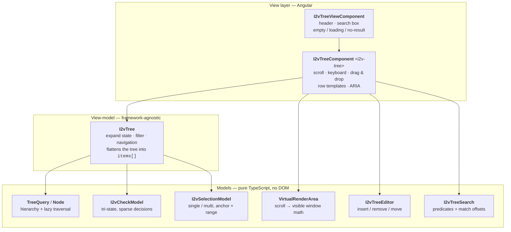
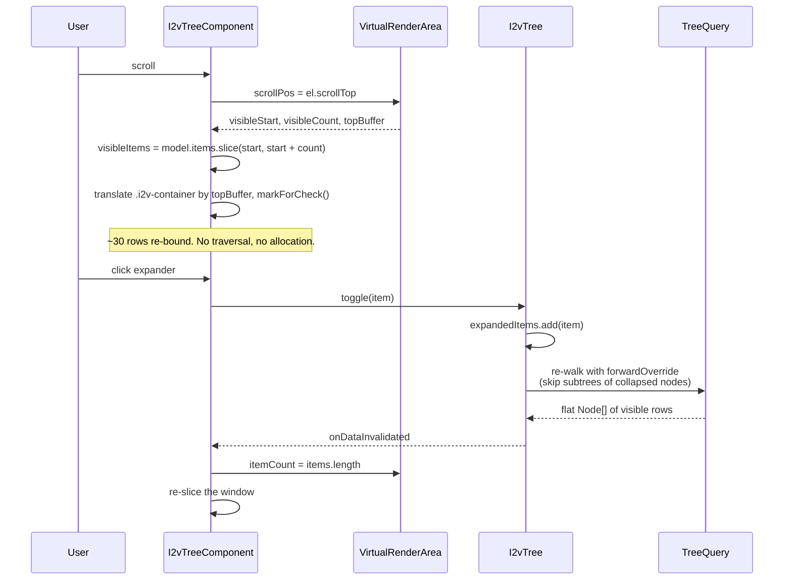

# i2v-tree 🌲

**A virtual tree for Angular that stays fast at 100,000 nodes.**

### ▶ [Open the live demo](https://claude.ai/code/artifact/2a360068-1175-40f4-b48c-b569f1f7c2cd)

The live build is the app in [projects/of-demo/](projects/of-demo/) — 100,000 real nodes, lazy-loaded
branches, and a side-by-side comparison of client-side vs server-side search. Scroll it, search it,
expand everything, and watch the row count stay honest.

**Bring your own data.** The demo's **Build a tree** panel generates a tree to whatever shape you
describe — any number of levels, any number of nodes at each — or you can add nodes one at a time.
See [Try it with your own data](#try-it-with-your-own-data).

---

## What is this?

`i2v-tree` is a single Angular component — `<i2v-tree>` — that renders arbitrarily large
hierarchies without choking the host application. It is a library, not a widget kit: no
dependencies beyond Angular itself, no styling opinions you cannot override, no assumptions
about the shape of your data.

```html
<i2v-tree [(selection)]="selected" [data]="nodes"></i2v-tree>
```

That's the whole minimum setup. Everything past that — templating, checkboxes, drag and drop,
lazy loading, keyboard navigation, search — is opt-in configuration on the same component.

## Why does it exist?

Business applications keep running into the same wall: a tree of assets, an org chart, a device
inventory, a file browser. It works beautifully with 200 nodes in the demo and falls apart in
production at 40,000, because rendering a hierarchy means rendering a hierarchy — a DOM node per
data node, all the way down.

Virtual scrolling solves this for **lists**. It does not solve it for **trees**, because a tree
is not a list: you cannot window a nested structure, and flattening it throws away the depth and
parent/child relationships that make it a tree in the first place.

The fix is a three-step recipe, and it is the whole idea behind this library:


Store the relationship metadata *first*, then flatten, then virtualize. Depth, siblings and
ancestry survive as `Node` metadata, so the flat row list still knows it is a tree. Only the rows
inside the scroll viewport ever exist in the DOM.

## Lineage — standing on someone else's shoulders

This project is a fork of **[gjcampbell/ooffice](https://github.com/gjcampbell/ooffice)**, and the
original `of-tree` library was written by **Gabriel J. Campbell** ([@gjcampbell](https://github.com/gjcampbell))
starting in 2019. The core insight above — hierarchy metadata, then flatten, then virtualize — the
`Node`/`TreeQuery` traversal model, and the `VirtualRenderArea` scroll math are his work, and they
have held up well enough that this fork kept them essentially intact.

The original is MIT licensed, and that license and copyright are preserved in [LICENSE](LICENSE).
If this library is useful to you, a good share of the credit belongs upstream.

This fork is maintained by **[Prabal Pandey](https://github.com/Prabal-I2v)** for
[i2vsys](https://github.com/kingpingx/TreeLibrary), which is where the `i2v` prefix comes from.

### What changed in this fork

| Area | Before (`of-tree`) | Now (`i2v-tree`) |
| --- | --- | --- |
| **Framework** | Angular 7.1, TypeScript 3.1, TSLint, Protractor scaffolding | Angular 18, TypeScript 5.5, ESLint, standalone components, `OnPush` |
| **Components** | `of-basic-tree` + `of-virtual-tree` — two components, one wrapping the other | One `<i2v-tree>`; it renders a built-in row when no template is projected. A separate `<i2v-tree-view>` adds the batteries — header, search box, empty/loading/no-result states |
| **Templating** | one bare `<ng-template>` for the whole row | typed row templates via `i2vTreeRow`, plus `i2vTreeRowPrefix` / `i2vTreeRowSuffix` slots, so per-row actions cost no library surface |
| **Selection** | a single `selectedItem` field | `I2vSelectionModel` — `none` / `single` / `multiple`, with ctrl and shift range gestures computed against *visual* order |
| **Checkboxes** | none | `I2vCheckModel` — tri-state, stored as sparse *decisions* rather than a flag per item, so `checkAll` is O(1) and a checked branch that has never been loaded still reads as checked |
| **Search** | mutated your node objects, rendered matches through `innerHTML` | `I2vTreeSearch` — string in, offsets out. Matches render as separate text nodes, so a search term can never inject HTML |
| **Editing** | reached into internal node objects | `I2vTreeEditor` — insert / remove / move against *your* arrays through a configured accessor, then reports which parents to invalidate |
| **Accessibility** | none to speak of | full `role="tree"` / `treeitem` semantics, `aria-level` / `posinset` / `setsize` / `expanded` / `selected` / `checked`, `aria-activedescendant`, type-ahead, Home/End, context-menu key |
| **Data model** | assumed known properties | fully schemaless — `childAccessor`, `canExpand`, `keyOf`, `getIcon`, `getIconUrl`, `getName`, `getTitle` all configurable; `keyOf` lets state survive a reload into new object identities |
| **Demo** | a synthetic sample tree | a real API-shaped payload scaled to 100,000 nodes, with genuine lazy loading and a client-vs-server search comparison — plus a [tree builder](#try-it-with-your-own-data) that generates any shape you describe and lets you add nodes by hand |
| **Tests** | a handful | spec suites for rows, drag, a11y, the tree view, and every model (`check`, `selection`, `query`, `search`, `editor`, `render-area`) |

Naming moved wholesale: `of-` → `i2v-` in package name, selectors, class names, and CSS classes.
The full migration table lives in [projects/i2v-tree/readme.md](projects/i2v-tree/readme.md#migrating-from-of-tree).

## Architecture

The library is deliberately layered so that **nothing below the component knows about the DOM**,
and nothing above the models knows about traversal.



**Why the split matters.** `I2vCheckModel` is composed into `I2vTree`, not inherited — so a
multiselect dropdown can hold check state and render chips *before its panel has ever been opened*
and the tree exists. `I2vSelectionModel` is deliberately separate from checks: selection is "what
the user is looking at" and follows the keyboard; checks are "what the user has picked" and persist.

### The file map

| Path | What lives there |
| --- | --- |
| [models/node.ts](projects/i2v-tree/src/lib/models/node.ts) | `Node<T>` — depth, parent, siblings, ancestry, forward/reverse traversal, lazy children |
| [models/tree-query.ts](projects/i2v-tree/src/lib/models/tree-query.ts) | `TreeQuery<T>` — a LINQ-ish iterable over the hierarchy: `where`, `skip`, `take`, `descend`, `hasDescendant`, `forwardOverride` |
| [models/virtual-render-area.ts](projects/i2v-tree/src/lib/models/virtual-render-area.ts) | scroll position + viewport height + item height → `visibleStart`, `visibleCount`, `topBuffer`, `totalHeight` |
| [models/check-model.ts](projects/i2v-tree/src/lib/models/check-model.ts) | tri-state checks as roots-minus-exclusions; survives lazy loading |
| [models/selection-model.ts](projects/i2v-tree/src/lib/models/selection-model.ts) | selection modes, anchor, ctrl/shift gestures |
| [models/tree-search.ts](projects/i2v-tree/src/lib/models/tree-search.ts) | `buildPredicate`, `getMatchRanges`, `getSegments` |
| [models/tree-editor.ts](projects/i2v-tree/src/lib/models/tree-editor.ts) | structural edits against your own arrays |
| [components/tree/tree.model.ts](projects/i2v-tree/src/lib/components/tree/tree.model.ts) | `I2vTree<T>` — the view-model: expand/collapse, filter, keyboard navigation, type-ahead, flattening |
| [components/tree/tree.config.ts](projects/i2v-tree/src/lib/components/tree/tree.config.ts) | `I2vTreeConfig<T>` — every hook the tree offers |
| [components/tree/tree.component.ts](projects/i2v-tree/src/lib/components/tree/tree.component.ts) | the component: scrolling, keyboard, drag & drop, ARIA, templates |
| [components/tree/tree.templates.ts](projects/i2v-tree/src/lib/components/tree/tree.templates.ts) | `i2vTreeRow` / `i2vTreeRowPrefix` / `i2vTreeRowSuffix` with typed context guards |
| [components/tree-view/](projects/i2v-tree/src/lib/components/tree-view/) | `<i2v-tree-view>` — the batteries-included wrapper |

## How it flows

### Rendering a frame



The flatten in the middle is the one non-trivial step. `invalidateData()` walks the query with a
`forwardOverride` that says *"if this node is collapsed, jump to its next sibling instead of
descending"* — so a collapsed subtree costs nothing to skip, and `expandAll()` over 100,000 nodes
is still one linear pass.

When a **filter** is active the walk flips to `descend().hasDescendant(predicate)`: expand state is
ignored entirely, and any node that matches — or contains a match — is visible. That is why search
results appear already unfolded.

### Lazy loading

`childAccessor` may return a `Promise`. The tree walk is synchronous, so a pending promise
contributes no children *yet*; the item reports `isLoading` through the state accessor, and whoever
started the load calls `invalidateItem()` when it settles. The walk picks the children up on the
next pass. `canExpand` is what decides whether an expander is drawn — not `children.length` — so a
node can advertise children it has not fetched.

The demo makes this concrete: every 20th server arrives with `children: []` and `isParent: true`,
and its cameras are only fetched when you open it.

### Client-side vs server-side search

The demo runs both, and reports the cost of each, because the trade-off is the actual design
decision in any large tree:

- **Client-side** — pull down *every* unfetched branch, then filter locally. Complete, but you pay
  one request per unloaded server before the first result appears.
- **Server-side** — ask the API which ids match, then fetch only the branches that actually contain
  a hit. One search request plus a handful of fetches.

Toggle between them in the live demo and watch the request count and elapsed milliseconds change.

## Try it with your own data

The fixed sample payload is one shape. Real trees are not — some are wide and shallow, some are
deep and narrow, some have one level with 20,000 siblings in it. The demo's **Build a tree** panel
exists so you can point the component at *your* geometry before you commit to it.

### Generate by level

A plan is one node count per level, and the panel previews what it costs before it builds anything:

```
Level 1  [ 3 ]  root nodes  · 3 nodes
Level 2  [ 5 ]  per parent  · 15 nodes
Level 3  [ 10 ] per parent  · 150 nodes
                              = 168 nodes total
```

- **`+ Level` / `− Level`** — up to 10 levels deep
- **Any width per level** — up to 5,000 children under a single parent
- **Lazy-load every Nth branch** — `0` builds a fully client-side tree; `5` keeps every fifth
  branch on the stub "server" so it arrives as `children: []` with `isParent: true` and only
  fetches when you open it. This is how you exercise the lazy path against your own shape.
- **Live preview** — the running total updates as you type, and `Generate tree` stays disabled
  past 500,000 nodes rather than locking up the tab

Generated nodes are named by their own address — `node 1`, `node 1.2`, `node 1.2.7` — so search,
type-ahead and the selected-path readout are all legible against them. Each node also gets a
synthetic IP and a `Level N` type, so both search modes have three fields to match on.

Some shapes worth trying:

| Plan | Produces | What it stresses |
| --- | --- | --- |
| `20000` | 20,000 roots, no nesting | pure list virtualization |
| `2 × 2 × 2 × 2 × 2 × 2 × 2 × 2 × 2 × 2` | 2,046 nodes, 10 deep | indent, keyboard descent, `expandAll` on a deep tree |
| `50 × 50 × 50` | 127,550 nodes | flatten cost at scale — `Expand all`, then scroll |
| `10 × 10` with lazy every `3` | 110 nodes, 3 branches fetched on demand | the loading state and the two search modes |

### Add nodes by hand

- **`+ Add root node`** appends at the top level
- **the `+` button on any row** (hover a row to reveal it) appends a child under that node
- **Name** sets what the next node is called; leave it blank for `new node 1`, `new node 2`, …

Adding a child to a branch whose children are still on the server fetches them first, so a hand-add
can't strand data behind a parent that now looks loaded. Both paths register the node with the stub
backend too, so server-side search finds it — the demo would otherwise have a node sitting in plain
sight that the "API" swears does not exist.

`Restore sample` puts the original 100,000-node payload back.

### Where it lives

The generator is [tree-builder.ts](projects/of-demo/src/app/demos/tree-builder.ts) — about 190 lines,
and independent of the library. It emits the same `TreeDataModel` shape as the sample payload, which
is the point: the row component, both search modes and the lazy-loading path all work against a
generated tree without a single change. Copy it as a starting point for your own fixtures.

## Execution

### Requirements

| | |
| --- | --- |
| Angular | 18.x |
| TypeScript | 5.5 |
| Node.js | ^18.19.1 \|\| ^20.11.1 \|\| >=22 |

### Commands

```bash
npm install

npm start            # serve the demo at http://localhost:4200
npm run build        # build the library into dist/i2v-tree
npm run build:demo   # build the demo into dist/of-demo
npm test             # unit tests (Karma + Jasmine, headless Chrome)
npm run lint         # ESLint
```

### Using it in your app

Install, then import the standalone component where you need it:

```typescript
import { Component } from '@angular/core';
import { I2vTreeComponent } from 'i2v-tree';

@Component({
    standalone: true,
    imports: [I2vTreeComponent],
    template: `
        <div class="container">
            <i2v-tree [(selection)]="selectedItem" [data]="treeData"></i2v-tree>
        </div>`,
    styles: [`.container { height: 400px; }`]
})
export class MyComponent {
    public selectedItem?: MyItem;
    public treeData: MyItem[] = [];
}
```

Two things the minimal setup needs: data with a `children` property, and a container with a
non-zero height — the tree sizes its window from the viewport it is given.

Still on NgModules? `I2vTreeModule` exports the same component and works unchanged.

**Own the row** by projecting a template. You get the `Node`, the row state, and the usual
index/first/last context:

```html
<i2v-tree [itemHeight]="28" [model]="model">
    <ng-template i2vTreeRow let-node let-state="state">
        <div class="my-row" [class.busy]="state.isLoading(node.item)">
            {{ node.item.name }}
        </div>
    </ng-template>
</i2v-tree>
```

**Bind to any shape** through config, rather than reshaping your data to suit the tree:

```typescript
public readonly model = new I2vTree<Device>({
    canExpand:      item => item.isParent,        // authority on expandability
    childAccessor:  item => item.children ?? undefined,
    keyOf:          item => item.id,              // state survives a reload
    lazyLoad:       true,
    selectionMode:  'multiple',
    checkboxes:     true
});
```

### Going further

- **[docs/USAGE.md](docs/USAGE.md)** — the practical guide: how to update nodes, edit structure,
  lazy-load, filter, template rows, and what to call so the tree notices. Start here.
- **[projects/i2v-tree/readme.md](projects/i2v-tree/readme.md)** — library readme and the
  `of-tree` → `i2v-tree` migration table.

## Keyboard

| Key | Does |
| --- | --- |
| `↑` `↓` | move the highlight |
| `→` | expand, then descend |
| `←` | collapse, then ascend to the parent |
| `Home` `End` | first / last visible row |
| `Enter` | select and toggle the highlighted row |
| `Space` | toggle its checkbox (or expand, when checkboxes are off) |
| `A`–`Z` | type-ahead; repeat a letter to cycle matches |
| `Shift+F10` / `Menu` | raise the context-menu event |
| `Esc` | emit `escape` for the host to handle |

## Known gap

The API-doc generator in [tools/](tools/) (`docjson-to-md.ts`, `ts-doc-parser.ts`, previously
`npm run docmd`) is written against TypeDoc 0.15 internals — `typedoc/dist/lib/models`,
`Application.expandInputFiles`, `flags.isExported`, `comment.shortText`, reflection `decorators` —
none of which exist in a TypeDoc release compatible with TypeScript 5.5. TypeDoc and those scripts
were left out of the Angular 18 upgrade and need a rewrite against the modern TypeDoc API before
`i2v-tree.gendoc.md` can be regenerated. Everything is documented in source doc comments in the
meantime.

## Browser support

Chrome and Firefox, current versions. Edge is partially supported. This is a component for
business applications where support can reasonably answer "did you try it in Chrome?" — targeting
one browser well is a deliberate cost decision. Fixing support for the others is a welcome
contribution.

## Contributing

Found a bug? A pull request is the best outcome, an issue with plenty of detail is the second best,
and silence is the worst. Run `npm start`, open [localhost:4200](http://localhost:4200), and go.

## License

MIT — see [LICENSE](LICENSE). Copyright © 2019 gjcampbell, and contributors to this fork.
