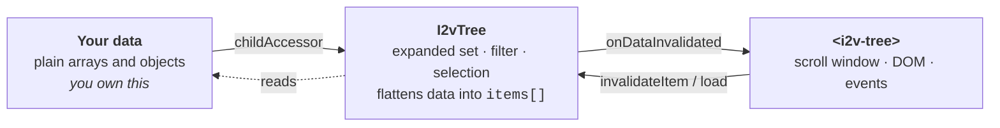

# Using i2v-tree

A practical guide: how to get data in, how to change it, and what to call afterwards so the tree
notices. If you only read one section, read [Updating nodes](#updating-nodes) — it is where most
of the questions land.

- [The mental model](#the-mental-model)
- [Getting started](#getting-started)
- [Configuring the tree](#configuring-the-tree)
- [Updating nodes](#updating-nodes)
- [Structural edits with I2vTreeEditor](#structural-edits-with-i2vtreeeditor)
- [Keeping state across a reload](#keeping-state-across-a-reload)
- [Lazy loading](#lazy-loading)
- [Searching and filtering](#searching-and-filtering)
- [Selection and checkboxes](#selection-and-checkboxes)
- [Custom rows](#custom-rows)
- [Drag and drop](#drag-and-drop)
- [Scrolling and navigation](#scrolling-and-navigation)
- [The batteries-included wrapper](#the-batteries-included-wrapper)
- [Troubleshooting](#troubleshooting)

---

## The mental model

Three things hold state, and knowing which owns what answers almost every "why didn't it update"
question:



**The tree never copies your data.** It wraps each item in a `Node<T>` that records depth, parent
and siblings, and it re-reads your arrays through `childAccessor` whenever you tell it to. So:

- Mutating your data is the *right* way to change the tree.
- The tree cannot know you did — nothing is watching your arrays.
- Every update is therefore two steps: **change the data, then tell the tree what changed.**

That second step is the whole of [Updating nodes](#updating-nodes).

---

## Getting started

### Install and import

```bash
npm i i2v-tree
```

The component is standalone:

```typescript
import { I2vTreeComponent } from 'i2v-tree';

@Component({
    standalone: true,
    imports: [I2vTreeComponent],
    // …
})
export class MyComponent {}
```

On NgModules instead? `I2vTreeModule` exports the same component and works unchanged.

> **What the module covers.** `I2vTreeModule` exports `I2vTreeComponent` and `SetAttrsDirective` —
> nothing else. `I2vTreeViewComponent` and the three row directives are standalone and imported
> directly, which works from a standalone component's `imports` *and* from an NgModule's `imports`:
>
> ```typescript
> @NgModule({ imports: [I2vTreeModule, I2vTreeRowDirective, I2vTreeRowSuffixDirective] })
> ```

### The simplest possible tree

```typescript
@Component({
    standalone: true,
    imports: [I2vTreeComponent],
    template: `
        <div class="container">
            <i2v-tree [data]="items" [(selection)]="selected"></i2v-tree>
        </div>`,
    styles: [`.container { height: 400px; }`]
})
export class MyComponent {
    public selected?: Item;
    public items: Item[] = [
        { name: 'Reports', children: [{ name: 'Q1', children: [] }] }
    ];
}
```

Two requirements the minimal form has:

1. **A `children` property** on each item — that is the default `childAccessor`.
2. **A container with a real height.** The tree sizes its scroll window from the element it is
   given. In a zero-height box it renders nothing at all. If the container settles late (flex,
   web fonts, a parent that sizes after paint), call `tree.invalidateSize()`.

> Binding `[(selection)]` emits `selectionChange` while the parent's inputs are still being set,
> which Angular's dev mode reports as `ExpressionChangedAfterItHasBeenChecked`. It settles on the
> next pass. Bind `[selection]` and `(selectionChange)` separately to avoid the warning.

### `[data]` or `[model]`?

`[data]` is the shortcut — the component creates an `I2vTree` for you and calls `load()` on it.
You get no handle to it, so you cannot expand, filter or edit from code.

For anything beyond display, own the model:

```typescript
import { I2vTree, I2vTreeComponent } from 'i2v-tree';

export class MyComponent {
    public readonly model = new I2vTree<Item>({
        childAccessor: item => item.children ?? undefined,
        canExpand: item => item.hasChildren
    });

    constructor() {
        this.model.load(this.items);
    }
}
```

```html
<i2v-tree [model]="model" [itemHeight]="28"></i2v-tree>
```

Now `model.expandAll()`, `model.setFilter(…)`, `model.invalidateItem(…)` are all yours. **Use
`[model]` for anything real** — the rest of this guide assumes it.

> Bind `[model]` *or* `[data]`, not both. `[data]` calls `load()` on whichever model the component
> currently holds, so setting both means whichever binding runs last wins.

---

## Configuring the tree

Config goes to the `I2vTree` constructor (or `[config]` on the component). Every option is
optional; these are the ones that matter most:

```typescript
new I2vTree<Item>({
    // --- Shape of your data ---------------------------------------------------------
    childAccessor: item => item.children ?? undefined,  // may also return a Promise
    canExpand:     item => item.isFolder,               // authority on the expander
    keyOf:         item => item.id,                     // stable identity across reloads
    lazyLoad:      true,                                // don't walk the whole tree up front

    // --- Appearance -----------------------------------------------------------------
    getName:    item => item.title,
    getIcon:    (item, node, state) => state.isExpanded(item) ? 'fa fa-folder-open' : 'fa fa-folder',
    getIconUrl: item => item.iconPath,                  // takes precedence over getIcon
    getTitle:   item => item.tooltip,
    itemIcon:   'fa fa-file-o',

    // --- Behaviour ------------------------------------------------------------------
    selectionMode: 'multiple',        // 'none' | 'single' | 'multiple'
    expandMode:    'accordion',       // 'multi' (default) | 'accordion' — one branch at a time
    checkboxes:    true,
    isDisabled:    item => item.readonly,
    highlightMatches: true,           // wrap filter matches in .i2v-match

    // --- Drag and drop --------------------------------------------------------------
    canDrag: item => item.movable,
    canDrop: ({ item, parent }) => parent?.isFolder ?? false,
    move:    async args => this.api.move(args.item, args.parent),
    allowedDropPositions: ['on'],     // reparent only, no reordering
});
```

Two hooks are worth calling out because getting them wrong is the most common setup bug:

**`canExpand` is the authority on the expander, not `children.length`.** This is what lets a node
say "I have children you haven't fetched yet". Without it, the tree falls back to "does this node
have loaded children", and a lazy branch renders as a leaf.

**`childAccessor` must return `undefined`, not `null` or `[]`, for "nothing to walk"** — or rather,
you should normalize whatever your payload uses:

```typescript
childAccessor: item => item.children ?? undefined   // null and undefined both mean "none"
```

To change config later, call `model.updateConfig(newConfig)` or re-bind `[config]`.

---

## Updating nodes

The tree is a view over your arrays. **Mutate your data, then tell the tree what changed.** Which
call you need depends on what you changed:

| You changed | Call | Cost |
| --- | --- | --- |
| A field on one item — name, icon, tooltip | `model.invalidateData()` | walks the visible rows |
| The children array of one item — added, removed, reordered | `model.invalidateItem(parent)` | re-reads that node's children |
| A whole branch, and you want it re-read from the accessor | `model.reloadChildren(parent)` | re-reads on demand |
| Everything, same array identity | `model.reloadTree()` | re-reads from the root |
| Everything, new array | `model.load(newRoots)` | rebuilds the query |

Everything below is that table, explained.

### Changing a node's own fields

Renaming a node, swapping its icon, flipping a status flag — nothing structural has happened, but
the component is `OnPush` and nothing marked it dirty:

```typescript
public rename(item: Item, name: string) {
    item.name = name;              // 1. change your data
    this.model.invalidateData();   // 2. tell the tree
}
```

`invalidateData()` re-flattens the tree and emits `onDataInvalidated`, which is what the component
listens to. It skips collapsed subtrees, so it costs roughly one pass over the *visible* rows —
cheap even on a huge tree.

> If your row is a component of your own using `input()` signals or `OnPush`, and it reads a plain
> mutable field, it may still not repaint. Either derive the value in the row (`{{ item.name }}` on
> a Default-change-detection row works fine), or hold the value in a signal.

### Adding and removing children

Splice your own array, then invalidate the **parent** — the node whose children list changed:

```typescript
public addChild(parentNode: Node<Item>, child: Item) {
    const parent = parentNode.item;
    (parent.children ??= []).push(child);
    parent.isFolder = true;                 // if canExpand reads a flag, keep it honest

    this.model.setExpanded(parent, true);   // so the new row is actually on screen
    this.model.invalidateItem(parent);      // re-reads this node's children, then repaints
}

public remove(node: Node<Item>) {
    const parent = node.parent;
    const siblings = !parent || parent.isRoot ? this.roots : parent.item.children!;

    siblings.splice(siblings.indexOf(node.item), 1);

    // A top-level node's parent is the tree's synthetic root, whose item is not one of yours,
    // so there is nothing to hand invalidateItem — reload from the root instead.
    if (parent && !parent.isRoot) {
        this.model.invalidateItem(parent.item);
    } else {
        this.model.reloadTree();
    }
}
```

That root case catches people out. `node.parent` is never `undefined` for a rendered row — top-level
rows have the tree's own synthetic root as their parent, and `parent.isRoot` is how you detect it.
`reloadTree()` is the call for a change at the top level.

`invalidateItem(item, reloadImmediately = true)` re-reads that node's children through your
accessor and then invalidates the data. Pass `false` to defer the re-read until the node is next
walked — useful when you are about to invalidate several parents in a row.

### Replacing the whole data set

```typescript
this.model.setFilter(undefined);    // a stale filter describes items that no longer exist
this.model.load(newRoots);
this.model.collapseAll();           // optional — expanded state is keyed by item identity
```

`load()` rebuilds the query from scratch and re-resolves check state against the new items (see
[Keeping state across a reload](#keeping-state-across-a-reload)). Selection and expanded state are
held as sets of your item objects, so they survive only if the *same objects* come back — which is
what `keyOf` is for on the check side, and why you usually want to clear selection explicitly.

### Refreshing from the server

If your accessor pulls from a cache that you have just refilled, you do not need `load()` — you
need the tree to ask again:

```typescript
async refreshBranch(parent: Item) {
    parent.children = await this.api.getChildren(parent.id);
    this.model.reloadChildren(parent);    // invalidate + re-read this branch
}

async refreshAll() {
    this.roots = await this.api.getRoots();
    this.model.load(this.roots);          // new array identity → load, not reloadTree
}
```

`reloadChildren(parent)` and `reloadTree()` both call `Node.invalidateChildren()`, which drops the
cached child nodes so the next walk re-reads your arrays. `reloadTree()` is `reloadChildren` on the
root.

### Expanding and collapsing from code

```typescript
model.toggle(item);                  // flip, and repaint
model.setExpanded(item, true);       // set, WITHOUT repainting — batch these
model.expandAll();
model.collapseAll();
model.expandToDepth(1);              // roots and their children only
model.expandToItem(item);            // open every ancestor, without repainting
model.isExpanded(item);
model.isExpandable(item);
```

`setExpanded` and `expandToItem` deliberately do not repaint, so you can set many and invalidate
once:

```typescript
for (const item of toOpen) {
    this.model.setExpanded(item, true);
}
this.model.invalidateData();     // one repaint for the lot
```

### Finding items

```typescript
model.findByKey('abc-123');                        // needs config.keyOf
model.findByField('status', 'offline');            // every loaded match
model.findItems(item => item.count > 10);
model.getTreeNode(item);                           // the Node<T>, for depth/ancestors/siblings
model.getItemIndex(item);                          // row index in the flattened list, or -1
model.countBy(item => item.type);                  // Map<string, number> for summaries
```

All of these walk **loaded** nodes only. Under lazy loading, an item whose branch has never been
fetched is not there to find.

---

## Structural edits with I2vTreeEditor

`I2vTreeEditor` does the array-splicing above for you, including the index correction that a
same-parent move needs. It knows nothing about the component — it edits your arrays and reports
which parents to invalidate.

```typescript
import { I2vTreeEditor } from 'i2v-tree';

const editor = new I2vTreeEditor<Item>(
    {
        childAccessor: item => item.children ?? undefined,
        // Without this, inserting into a childless item is a no-op — the editor will not guess
        // a property name on your data.
        setChildren: (item, children) => (item.children = children)
    },
    () => this.roots            // where root-level items live
);
```

```typescript
// Insert — parent undefined means "at the root"
editor.insert(parent, [newItem], 2);

// Remove — reports the parent to invalidate
const { removed, parent } = editor.remove(item, model.query);
if (removed) {
    parent ? model.invalidateItem(parent) : model.reloadTree();
}

// Move — rejects a move into the item's own subtree, and returns both ends
const moved = editor.move(item, newParent, index, model.query);
if (moved) {
    model.invalidateItem(moved.from);
    model.invalidateItem(moved.to);
}

editor.removeChildren(parent);
editor.isAncestorOf(candidate, item, model.query);
```

`move` returns `undefined` when the move is illegal — into its own descendant, or of an item the
query does not know. Both `from` and `to` may be `undefined`, meaning the root level; pair that with
`reloadTree()` as above.

---

## Keeping state across a reload

By default the tree identifies items **by object reference**. Reload the same data from an API and
you get new objects — so expanded state, selection and checks all evaporate.

`keyOf` fixes this for check state:

```typescript
new I2vTree<Item>({
    childAccessor: item => item.children ?? undefined,
    keyOf: item => item.id          // stable identity
});
```

With `keyOf` set, `load()` calls `checks.rebuild()`, which re-points every check decision at the
new object carrying the same key. A branch checked before the reload is still checked after it —
including branches that have not been loaded at all.

Expanded state and selection are still reference-keyed. To carry those across a reload, capture and
restore them yourself:

```typescript
const openIds = model.items.filter(n => model.isExpanded(n.item)).map(n => n.item.id);
const selectedId = model.getSelectedItem()?.id;

model.load(fresh);

for (const id of openIds) {
    const item = model.findByKey(id);
    if (item) {
        model.setExpanded(item, true);
    }
}
model.invalidateData();

const selected = selectedId === undefined ? undefined : model.findByKey(selectedId);
if (selected) {
    model.selectAndHighlight(selected);
}
```

---

## Lazy loading

Return a `Promise` from `childAccessor` and the item opts into lazy loading:

```typescript
new I2vTree<Item>({
    lazyLoad: true,
    canExpand: item => item.isParent,        // required — see below
    childAccessor: item => {
        if (item.children) {
            return item.children;            // already loaded
        }
        if (item.isParent) {
            return this.api.getChildren(item.id).then(kids => (item.children = kids));
        }
        return undefined;
    }
});
```

What happens: the tree walk is synchronous, so a pending promise contributes **no children yet**.
The item reports `true` from `state.isLoading(item)` while it settles, and the component calls
`invalidateItem()` when it does — at which point the walk re-reads the children and they appear.

Three rules make this work:

1. **`canExpand` must not read `children.length`.** A node that has advertised children it hasn't
   fetched has none loaded, and would render as a leaf.
2. **The accessor must return the loaded array from then on.** One that keeps returning a promise
   reloads forever — note the `.then(kids => (item.children = kids))` above, which stores them.
3. **`lazyLoad: true`** stops the tree from eagerly walking the entire hierarchy on `load()`.

Driving the fetch yourself instead — because you want a busy flag on the node, or to load on
expander click rather than on walk — is equally valid:

```typescript
public async toggle(item: Item) {
    if (item.isParent && !item.children?.length) {
        item.loading = true;
        try {
            item.children = await this.api.getChildren(item.id);
        } finally {
            item.loading = false;
        }
        this.model.setExpanded(item, true);
        this.model.invalidateItem(item);
        return;
    }
    this.model.toggle(item);
}
```

That is what the demo does, and it is why the demo's rows can show their own spinner.

---

## Searching and filtering

Three inputs, and they do different things:

| Input | Filters | Highlights |
| --- | --- | --- |
| `[filterText]` | yes, on the name | yes |
| `[filter]` | yes, on your predicate | no |
| `[highlightTerm]` | no | yes |

A filter **ignores expand state entirely**. Any node that matches, or contains a match, is visible —
which is why results appear already unfolded. `model.isFiltered()` tells you a filter is active, and
the built-in row hides expanders while one is.

From code:

```typescript
model.setFilter(item => item.status === 'offline');
model.setFilter(undefined);          // clear
```

`[filter]` and `[filterText]` compete — a wrapper that applies its own filter should use
`[highlightTerm]` for the marking, not `[filterText]`, or the two schedule against each other.

`I2vTreeSearch` is the matching helper, and it is deliberately string-in, data-out — nothing touches
your items:

```typescript
import { I2vTreeSearch } from 'i2v-tree';

const predicate = I2vTreeSearch.buildPredicate<Item>(term, item => [item.name, item.ip, item.type]);
model.setFilter(term ? predicate : undefined);

I2vTreeSearch.getMatchRanges('camera-04', 'era');   // [[3, 6]]
I2vTreeSearch.getSegments('camera-04', 'era');      // alternating { text, match } segments
```

`getSegments` always covers the whole string, so joining every `text` reproduces the input — which
is what keeps highlighting from silently dropping characters. Render the segments as elements; never
interpolate a search term into markup.

Type-ahead is separate and always on: typing letters into a focused tree jumps to the next row whose
name starts with them, and repeating one letter cycles the matches.

---

## Selection and checkboxes

These are two different things, deliberately:

- **Selection** is what the user is looking at. It follows the keyboard and drives detail panes.
- **Checks** are what the user has picked. They persist, and they survive lazy loading.

### Selection

```typescript
new I2vTree<Item>({ selectionMode: 'multiple' });   // 'none' | 'single' | 'multiple'
```

```typescript
model.select(item);                  // set, emit
model.selectAndHighlight(item);
model.getSelectedItem();             // the last single selection
model.getSelectedItems();            // every selected item
model.isSelected(item);

model.selection.getSelected();
model.selection.getAnchor();         // where a shift-range extends from
model.selection.setSelected([a, b]);
model.selection.clear();
model.selection.onSelectionChanged.subscribe(items => …);
```

Ctrl and shift gestures are handled for you on click. A shift-range is computed against the
**visual** order of the flattened rows, not the data order — which is what a user means by
"everything between these two".

### Checks

Turn on `checkboxes: true` and the built-in row renders a real `<input type="checkbox">` with proper
tri-state. The interesting part is how state is stored: as a sparse set of *decisions* — "this
subtree is checked, except these" — rather than a flag per item.

That is what makes this work:

```typescript
model.checks.checkAll();                       // O(1), even on a million nodes
model.checks.setChecked(unloadedBranch, true); // no fetch — children read as checked when they arrive

model.checks.getState(item);                   // 'checked' | 'unchecked' | 'indeterminate'
model.checks.isChecked(item);
model.checks.toggle(item);
model.checks.setCheckedMany(items, true);      // emits once, not per item

model.checks.getSelection();                   // { roots, excluded } — survives lazy loading
model.checks.setSelection(saved);              // restore it, items need not be loaded
model.checks.getCheckedRoots();                // shallowest checked items — one chip each
model.checks.getCheckedItems();                // every LOADED checked item
model.checks.getCheckedLeaves();
model.checks.clear();

model.checks.onCheckChanged.subscribe(({ item, checked, source }) => …);   // 'user' | 'api' | 'cascade'
```

**`getSelection()` is the one to persist**, not `getCheckedItems()`. Only loaded items can be
enumerated, so under lazy loading `getCheckedItems()` is a partial answer by construction; the
roots-minus-exclusions form describes items that have never been fetched.

Check options live on the tree config:

```typescript
new I2vTree<Item>({
    keyOf: item => item.id,
    checkboxes: true,
    check: {
        cascade: 'subtree',        // or 'none' to check items individually
        promoteParents: true,      // all children checked → one decision on the parent
        canCheck: item => !item.readonly,
        defaultChecked: false
    }
});
```

`promoteParents` defaults **off** under `lazyLoad`, because a parent's children may not all be
present yet and promoting on a partial view would be wrong.

The check model can also be created *before* the tree and handed in — which is how a multiselect
dropdown renders its chips while its panel has never been opened:

```typescript
const checks = new I2vCheckModel<Item>({ keyOf: item => item.id });
// …later, when the panel opens:
const model = new I2vTree<Item>(config, undefined, checks);
```

---

## Custom rows

Project an `<ng-template>` and the tree renders that instead of its built-in row:

```html
<i2v-tree [model]="model" [itemHeight]="28">
    <ng-template i2vTreeRow let-node let-state="state" let-index="absoluteIndex">
        <div class="row" [class.selected]="state.isSelected(node.item)">
            <span [style.paddingLeft.rem]="node.depth * 1.2">{{ node.item.name }}</span>
            @if (state.isLoading(node.item)) { <span class="spinner"></span> }
        </div>
    </ng-template>
</i2v-tree>
```

Use the `i2vTreeRow` directive rather than a bare `<ng-template>`: under `strictTemplates` a bare
one types `node` as `any`, and the directive carries the context guard that types it properly. A
bare template still works, for compatibility.

Import the directive alongside the component, or the attribute is silently inert and you get the
built-in row instead:

```typescript
import { I2vTreeComponent, I2vTreeRowDirective } from 'i2v-tree';

@Component({ standalone: true, imports: [I2vTreeComponent, I2vTreeRowDirective], /* … */ })
```

The context you get:

| Binding | Is |
| --- | --- |
| `$implicit` | the `Node<T>` — `.item`, `.depth`, `.parent`, `.children`, `.ancestors()` |
| `index` | position within the *rendered window* |
| `absoluteIndex` | position within the whole flattened tree |
| `count`, `first`, `last`, `even`, `odd` | as `NgForOf` |
| `state` | `isExpanded` / `isSelected` / `isHighlighted` / `isLoading` accessors |

**Rows must render at exactly `[itemHeight]`.** The scroller positions rows by arithmetic; a row
that renders taller than it claims makes the whole viewport drift.

To keep the built-in row and just add to it, use the slot directives instead:

```html
<i2v-tree [model]="model">
    <ng-template i2vTreeRowPrefix let-node><span class="badge">{{ node.item.count }}</span></ng-template>
    <ng-template i2vTreeRowSuffix let-node>
        <button (click)="edit(node.item); $event.stopPropagation()">Edit</button>
    </ng-template>
</i2v-tree>
```

Prefix renders before the expander, suffix after the label. Per-row actions belong in the suffix.

### Events

```html
<i2v-tree
    [model]="model"
    (selectionChange)="onSelect($event)"
    (rowClick)="onRowClick($event.event, $event.item)"
    (itemDblClick)="open($event.item)"
    (itemContextMenu)="showMenu($event.event, $event.item)"
    (itemActivate)="open($event.item)"
    (expandChange)="log($event.item, $event.expanded)"
    (checkChange)="onCheck($event.item, $event.checked)"
    (activeItemChange)="onKeyboardFocus($event)"
    (escape)="close()"
></i2v-tree>
```

`iconClick` and `labelClick` fire for the built-in row's icon and label specifically.

---

## Drag and drop

Off by default. Three hooks turn it on:

```typescript
new I2vTree<Item>({
    canDrag: item => !item.locked,
    canDrop: ({ item, parent, parentNode, index }) => parent?.isFolder ?? false,
    move: async ({ item, parent, index }) => {
        await this.api.move(item.id, parent?.id ?? null, index);
    },
    allowedDropPositions: ['before', 'on', 'after']    // 'on' alone = reparent only
});
```

`move` is awaited, and both affected parents are invalidated afterwards. If you leave `move` out,
the built-in one splices between the arrays reachable through `childAccessor` — fine for plain
nested data, wrong if your data lives in a store or on a server.

Hovering over a collapsed node during a drag opens it after ~600ms. Drops between windows work
through the `application/json.i2v-tree-item` dataTransfer key; supply `getDragData` to control the
payload.

A **custom row** must opt in, since the built-in row's drag wiring is not yours:

```html
<i2v-tree #tree [model]="model">
    <ng-template i2vTreeRow let-node>
        <div [draggable]="tree.canDrag(node.item)" (dragstart)="tree.handleDragstart($event, node)">
            {{ node.item.name }}
        </div>
    </ng-template>
</i2v-tree>
```

---

## Scrolling and navigation

Grab the component with a template reference or `@ViewChild`:

```typescript
@ViewChild(I2vTreeComponent) public tree!: I2vTreeComponent;
```

```typescript
tree.scrollToItem(item);        // scroll only if it is off screen
tree.scrollToIndex(42);
tree.scrollTo(1200);            // raw pixels
tree.scrollToSelected();
tree.getScrollPos();

tree.navigateToItem(item);      // expand every ancestor AND scroll to it
tree.navigateToSelection();

tree.invalidateSize();          // after the container's height changes
tree.syncScrollPos();           // after a DOM height change desyncs the scroller
```

`navigateToItem` is the one you usually want — "reveal this node" at any depth, from anywhere.
`scrollToItem` alone silently does nothing if the item's ancestors are closed, because it is not in
the flattened row list.

`invalidateSize()` is the fix for a tree that renders blank inside a container that sizes late — a
tab that was hidden at init, a flex parent, a dialog that animates open.

---

## The batteries-included wrapper

`<i2v-tree-view>` wraps the tree with a header, a search box, and empty / loading / no-result
states, for when you would otherwise build the same chrome again:

```html
<i2v-tree-view
    [model]="model"
    title="Devices"
    [showSearch]="true"
    [searchFields]="[{ key: 'name', label: 'Name' }, { key: 'ip', label: 'IP' }]"
    [searchDebounce]="300"
    [searchMinLength]="2"
    [showExpandToggle]="true"
    [showRefresh]="true"
    [showCount]="true"
    [countBy]="countByType"
    [loading]="loading()"
    emptyText="No devices."
    noResultText="Nothing matched."
    (refresh)="reload()"
    (searchTextChange)="onSearch($event)"
    (itemContextMenu)="showMenu($event)"
>
    <ng-template i2vTreeRow let-node>…</ng-template>
    <ng-template #i2vTreeEmpty>Nothing here yet. <a (click)="add()">Add one</a></ng-template>
</i2v-tree-view>
```

Two deliberate choices worth knowing: every user-visible string is an input with an English default
rather than a translation key, so the library carries no i18n dependency — bind
`[emptyText]="'No data' | translate"` to localize. And menus are *raised as events*, not rendered,
so you supply your own menu component.

---

## Troubleshooting

| Symptom | Cause | Fix |
| --- | --- | --- |
| Nothing renders | The container has no height | Give it one; call `tree.invalidateSize()` if it settles late |
| Every row renders at once | Same — a zero item height or viewport | Set `[itemHeight]`, check the container |
| Rows drift as you scroll | A row renders taller than `[itemHeight]` | Fix the row's height; they must match exactly |
| Changed a name, nothing repainted | `OnPush`, and nothing marked it dirty | `model.invalidateData()` |
| Added a child, nothing appeared | The tree still has the cached child nodes | `model.invalidateItem(parent)` |
| Removed a top-level node, nothing happened | `invalidateItem(node.parent.item)` on the synthetic root | Check `parent.isRoot`, use `model.reloadTree()` |
| A lazy branch shows no expander | `canExpand` reads `children.length` | Read your own `isParent` flag instead |
| A lazy branch reloads forever | The accessor keeps returning a promise | Store the result and return the array afterwards |
| Checks vanished after a reload | State is reference-keyed | Set `config.keyOf` |
| `getCheckedItems()` misses checked nodes | It only enumerates loaded items | Use `checks.getSelection()` |
| `scrollToItem` does nothing | Ancestors are collapsed, so the item is not a row | `tree.navigateToItem(item)` |
| `ExpressionChangedAfterItHasBeenChecked` | `[(selection)]` emits during the parent's input pass | Split into `[selection]` + `(selectionChange)` |
| Two trees fight over expand-all | Shared state in your own wrapper | `<i2v-tree-view>` holds it per instance |
| Drag does nothing on a custom row | The built-in drag wiring is not in your template | Wire `[draggable]` + `(dragstart)` to `tree.canDrag` / `tree.handleDragstart` |

---

## See also

- [README](../README.md) — what this is, the architecture, and the live demo
- [projects/i2v-tree/readme.md](../projects/i2v-tree/readme.md) — the library readme and the
  `of-tree` → `i2v-tree` migration table
- [projects/of-demo/](../projects/of-demo/) — a working app exercising lazy loading, both search
  strategies, custom rows and the tree builder
